 

 

 

 

  

  

<h3 align="center"><code>y4sssh@github ~ $ whoami</code></h3>

<table>
  <tr>
    <td valign="top"></td>
    <td valign="top"></td>
  </tr>
</table>

  

###  Contribution's

<picture>
  <source media="(prefers-color-scheme: dark)" srcset="https://raw.githubusercontent.com/y4sssh/y4sssh/output/github-contribution-grid-snake.svg" />
  <source media="(prefers-color-scheme: light)" srcset="https://raw.githubusercontent.com/y4sssh/y4sssh/output/github-contribution-grid-snake.svg" />
  
</picture>

###  Tech Stack

 

  

 

  

 

  

 

### 💼 Experience

**Software Development Intern**
*CrescentWeb*
`Dec 2024` – `Feb 2025`

- Developed responsive web applications
- Worked with modern web technologies
- Improved frontend development skills
- Collaborated on real-world software projects

`Web Development` `Frontend` `Responsive Design`

 

**Software Development Intern**
*Microspectra Software Technologies Pvt. Ltd.*
`Jun 2023` – `Jul 2023`

- Internship Training Programme
- Worked on software development concepts
- Learned industry development workflow
- Improved programming and debugging skills

`Software Development` `Debugging` `Industry Workflow`

 

### ✍️ Motivational Dev Quote

### 🤝 Connect

*"Code. Learn. Build. Repeat."*
 ### ⭐ Thank You! ⭐
  

---
